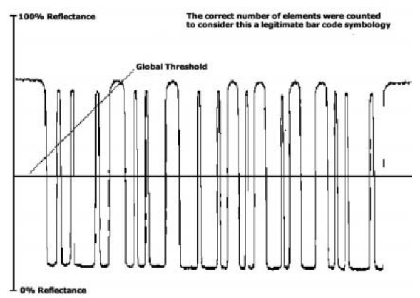

Todos conocemos lo que es un código de barras, un conjunto de barras verticales de colores blanco y negro. 

Cuando el lector emite luz sobre el código de barras, las barras negras absorben la luz mientras que las blancas la reflejan. Un sensor dentro del lector interpreta estos cambios de luz, asignando un valor binario de 1 para la reflexión y 0 para la absorción.

De esta forma hemos conseguido convertir una señal analógica, como son las señales que se obtienen al reflejar, a una señal digital fácilmente interpretable por un ordenador, binario.

Si supera el umbral, entonces 1. Sino 0

